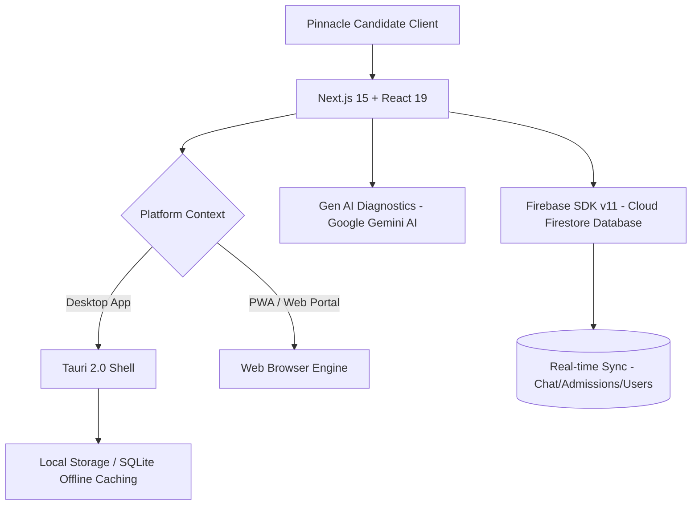

# 🌌 PINNACLE ACADEMIA | Educational Prep Platform (CBT, Syllabus & Mentorship)


Welcome to **Pinnacle Academia**, an advanced, high-performance study portal designed to empower student candidates preparing for national examinations like JAMB UTME, WAEC (WASSCE), NECO, and university Post-UTME screenings. 

Pinnacle Academia unifies syllabus tracking, timed CBT simulation, gamified study battles, peer forums, and direct mentorship into a sub-10ms desktop, web, and mobile app environment.

---

## 🚀 Key Platforms & Deployment Targets

1. **Desktop App (Windows/macOS)**
   - Built using **Tauri 2.0** and **Next.js 15** for native, ultra-lightweight performance.
   - Offline-first capabilities for downloading test banks and tracking syllabus checklists without an active internet connection.

2. **Tactical Mobile Web App (PWA)**
   - Adaptive design configured for smart devices, supporting service worker caching and push notifications.
   - Enables on-the-go syllabus tracking, novel reviews, and quick peer forum chat.

3. **Academy Admin Console**
   - Secured route at `/admin-sheun` for administrators to moderate forums, register mentors, update university course cut-offs, construct novel study check-ins, and upload new CBT questions.

---

## 🛠️ Technical Stack & Architecture

Pinnacle Academia is engineered for performance, security, and real-time synchronization:



### 1. Front-end Framework & Desktop Shell
- **Next.js 15.5.9** (App Router & React 19) for lighting-fast routing and server/client page hydration.
- **Tauri 2.0** (Rust-backed native desktop environment) for rendering lightweight executables with extremely low memory footprints.
- **Framer Motion** for premium glassmorphism transitions and micro-animations.

### 2. Database & Sync
- **Firebase SDK v11.9.1**: Direct integrations to **Cloud Firestore** for real-time peer forum updates, user profile mappings, and admin broadcasts.
- **Firebase Admin SDK v13.6.1**: Secure, server-side data validations, role authorization, and tenant access control.

### 3. AI Learning Assistant
- **Google Gemini AI**: Powering predictive study diagnostics, syllabus troubleshooting guides, and automatic study suggestions based on student test scores.

---

## 🛡️ Core Capabilities & Modules

- **JAMB Syllabus Tracker**: Multi-subject curriculum outlining modules, topics, and completion status. Ticking topics computes overall syllabus coverage percentages.
- **CBT Exam Simulator**: Fully custom practice mode simulating the CBT interface. Students can select core subjects, set custom timers, answer test bank questions, and review explanations.
- **Peer Community Forums**: Nairaland-style real-time group chat channels (`general-study`, `jamb-prep`, `post-utme-talk`, etc.) to interact and share tips.
- **Mentorship Bookings**: Schedule 15-minute consultation calls with registered, high-performing student mentors for scheduling guidelines.
- **Admission Calculator**: Automatically calculates aggregate admission marks using UI, OAU, UNILAG, ABU, and UNIBEN weights.
- **Text Novel Summaries**: Study summaries and take quick comprehension check quizzes for recommended literature books (*The Life Changer*, *Sweet Sixteen*).
- **Offline Speed Battles**: Gamified quiz challenges against adaptive study bots (Easy, Medium, Hard) to build accuracy and speed under pressure.

---

## ⚙️ Developer Setup & Installation

### Prerequisites
- **Node.js**: v18.x or higher
- **Rust & Cargo** (For Tauri desktop packaging): [Prerequisites Setup](https://v2.tauri.app/start/prerequisites/)

### 1. Clone & Set Up
```bash
git clone https://github.com/I-m-a-m-4/Pinnacle-Academia.git
cd Pinnacle-Academia
npm install
```

### 2. Configure Environment Variables
Create a `.env.local` file in the root directory:
```env
NEXT_PUBLIC_FIREBASE_API_KEY=your_key
NEXT_PUBLIC_FIREBASE_AUTH_DOMAIN=your_domain
NEXT_PUBLIC_FIREBASE_PROJECT_ID=your_project_id
NEXT_PUBLIC_FIREBASE_STORAGE_BUCKET=your_bucket
NEXT_PUBLIC_FIREBASE_MESSAGING_SENDER_ID=your_sender_id
NEXT_PUBLIC_FIREBASE_APP_ID=your_app_id
GEMINI_API_KEY=your_gemini_api_key
```

### 3. Run Locally
- **Run Web Portal**:
  ```bash
  npm run dev
  ```
  Accessible locally at `http://localhost:9007`.

- **Run Desktop Client**:
  ```bash
  npm run tauri dev
  ```

---

© 2026 Pinnacle Academia. All Rights Reserved. Engineered for candidate success.
